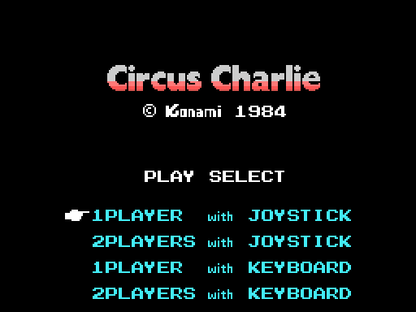

# The cartridge

16 KB in page 1 (`0x4000-0x7FFF`), an `AB` header with INIT at `0x407B` and no
BASIC. The screen is SCREEN 2.

## The RAM

**The game's whole RAM is 1 KB**: `0xE000-0xE3FF`, cleared by INIT with the
`ldir` over itself. The stack sits at `0xE500`.

| area | what is there |
|---|---|
| `0xE000` | the current scene |
| `0xE003` | the frame counter |
| `0xE005` | the interrupt re-entry lock |
| `0xE052` | the act type, 0 to 4 |
| `0xE0B0` | the buffer for the 32 sprites, copied whole to `0x3B00` every frame |
| `0xE130` | the player: position, position and pose |
| `0xE150` / `0xE170` / `0xE1B0` | the moving objects, the pick-ups and the loose one |
| `0xE280` | the second decompressor's buffer |

## The BIOS

It uses seven routines: RDVDP, SETRD, SETWRT, WRTVDP, WRTPSG, RDPSG and SNSMAT.
And it reads two bytes of its table, `(0x0006)` and `(0x0007)`, which are the
VDP ports.

## The two menu screens

**They are not the same one**: the company screen (the KONAMI logo and "-
VIDEO CARTRIDGE -") and the title screen. They share their scenery byte for
byte; only the name table changes. Both are drawn from the ROM and checked
down to zero bytes.

