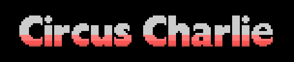
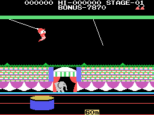
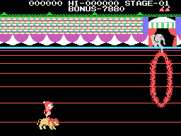
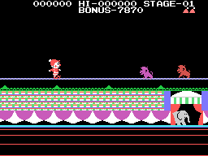
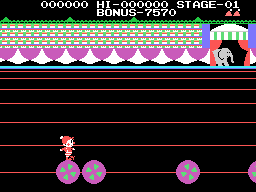
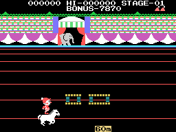
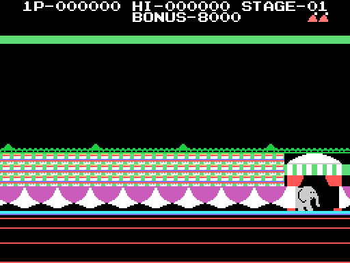
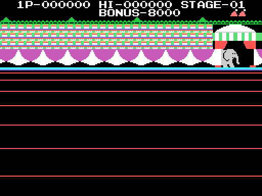

# The game

Charlie the clown has to cross the ring in **five circus acts**. Each act is a
stage type, the byte `(0xE052)`, and the cartridge dispatches on it for
everything that changes: the scenery, the start, the moving objects and the
frame. **The first act is the lion**, measured by running the cartridge
without forcing anything.

The five pictures below **are not captures**: they are the cartridge running in
`tools/corre_circus.py`. Checked against openMSX at the same instants, they
have zero VRAM bytes different.

## 0 · The trapeze

Charlie jumps from one trapeze to the other, with the trampoline below. The two
trapezes swing each to its own rhythm: four rhythm bytes set by hand at
`0x6161` and a single duration table, `0x5F61`, for both. It is the busiest
frame in the cartridge: six calls at `0x4CC2`.

## 1 · The lion

Charlie rides the lion and jumps through the rings of fire. Charlie is four
sprites, and here the same routine, `0x5087`, adds three more for the lion;
that is why this act's pose table (`0x5116`) spends **seven bytes per pose**
and the others' four. The rings are four moving objects starting on row
`0x48`, and the ring is drawn with **background tiles**, not sprites.

## 2 · The tightrope

The monkeys come along the rope. The loose one lives at `0xE1B0` and comes in
at `(0xD0, 0x50)`.

## 3 · The balls

Charlie balancing on a ball, with the others rolling towards him: they are the
pick-ups at `0xE170`.

## 4 · The horse

Charlie on horseback, with what has to be jumped coming in through a script of
its own (`0x5C8E`). The horse is three sprites, with a step that changes every
four frames (`0x50D8`).

## The BONUS

It starts at **8000**, in BCD (`0x42F8`), and goes down every eight frames.

## The five sceneries

As they stand when the set-up ends, before the game puts anyone in the ring.
They come from the chain at `0x5FD6`, rewritten in `tools/graficos.py`, and are
checked against openMSX at `0x4C3C`: zero bytes.

